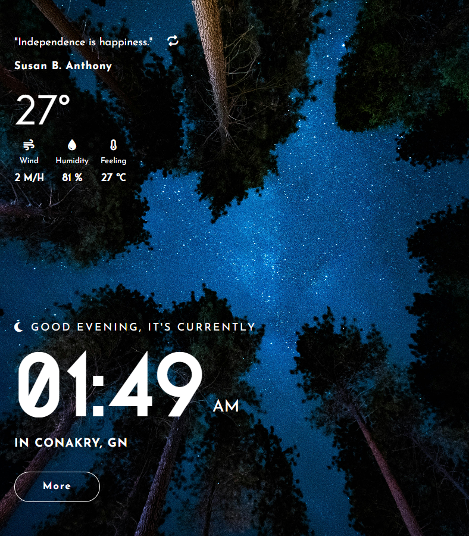

# CLOCK APP

## [Demo Link](https://www.demo-link.com)

## Welcome! 👋

This is a Clock and Widget App to display the currently hours and minutes based on the users location, show the meteo of the current zone in realtime, set some quotes for inspiration and More Details on the current Date. Inspired from this Frontend Mentor Challenges [Frontend Mentor - Clock App](https://www.frontendmentor.io/challenges/clock-app-LMFaxFwrM).

## Used APIs

- Quote API: [Quotable API](https://api.quotable.io)
- World Time API: [World Time API](https://worldtimeapi.org/)
- IP Geolocation API: [IP Geolocation API](https://ip-api.com/)
- Weather API: [Tomorrow Weather API](https://www.tomorrow.io/weather-api/)

## UI ScreenShots

### Mobile


### Tablet



### Desktop


### More Details


## Built with

- Semantic HTML5 markup
- SASS
- CSS custom properties
- Flexbox
- CSS Grid
- Mobile-first workflow
- [Vite Js](https://vitejs.dev/) Javascript Bundler.
- [PNPM](https://pnpm.io/) Package Manager.
- [React Js](https://react.dev/) UI Library.
- [Axios](https://axios-http.com/) for HTTP Request.
- [Framer-motion](https://framer-motion.com/) for Animation.
- [Gsap](https://gsap.com/) for Animation.

## How To Use This Repos

To clone and run this application, you'll need [Git](https://git-scm.com) and [PNPM](http://pnpm.io/) installed on your computer. From your command line:

```bash
# Clone this repository
$ git clone https://github.com/SouleymaneSy7/clock-app

# Install dependencies
$ pnpm install

# start the server
$ pnpm dev
```

## Author

- GitHub - [Souleymane Sy](https://github.com/SouleymaneSy7)
- Frontend Mentor - [@SouleymaneSy7](https://www.frontendmentor.io/profile/SouleymaneSy7)
- Dev Challenges - [Souleymane Sy](https://devchallenges.io/profile/534cd213-3165-4c16-bdcf-058e1f468da0)
- Twitter - [@Souleymanesy43](https://twitter.com/Souleymanesy43)
